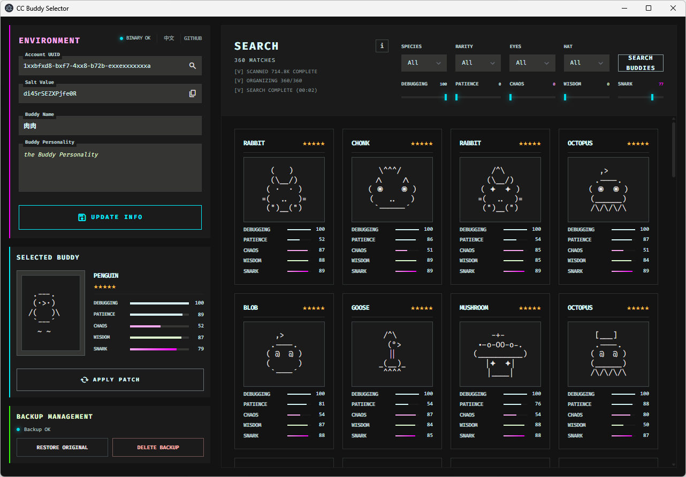
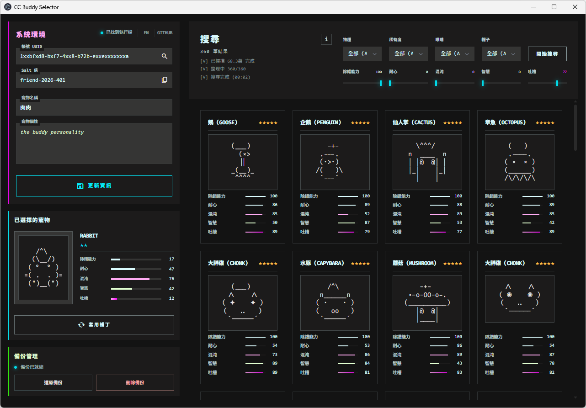

# CC Buddy Selector

[](./LICENSE)


An open-source Electron desktop app for finding, filtering, previewing, and applying code buddies.

[繁體中文](#繁體中文-zh-hant-tw) | [English](#english)

## English

### Overview

CC Buddy Selector helps you discover, preview, and apply a code buddy through a local desktop workflow.

It detects your local environment, reads your account UUID from `~/.claude.json`, searches buddy candidates by salt, and lets you apply the selected result with backup/restore support.



### Features

- Auto-detect account UUID and Claude binary path
- Search buddy combinations by species, rarity, eye, hat, and stat filters
- Preview buddy appearance and rolled attributes before applying
- Patch selected salt into the target binary
- Backup, restore, and delete backup for safer recovery
- Update buddy name and personality from the app
- Traditional Chinese / English UI support

### Prerequisites

- `claude` CLI is installed and available in PATH (`where claude` / `which claude` should work)
- You have opened Claude Code at least once so `~/.claude.json` exists
- Your config contains a valid account UUID (`oauthAccount.accountUuid` or `userID`)
- For name/personality updates, `~/.claude.json` includes `companion` fields
- Local development requires Node.js and npm

### Quick Start (End User)

1. Launch the app.
2. Confirm account UUID and Claude binary path are detected.
3. Set filters and run search.
4. Pick a result from the list and preview it.
5. Create backup (if not already created).
6. Apply selected buddy.
7. If needed, restore original binary from backup.

### Development

#### Run locally

```bash
npm install
npm start
```

#### Build

```bash
npm run build:win
npm run build:mac
npm run build:all
```

### Troubleshooting

- `Claude binary not found`
  - Ensure `claude` CLI is installed and reachable from your shell PATH.
- `Config not found at ~/.claude.json`
  - Open Claude Code once, then retry.
- `Default salt token was not found in target binary`
  - Your installed Claude version may be incompatible with current patch logic. Restore backup and verify version compatibility.
- Search process fails with Bun-related error
  - Keep the project `bin/` resources intact, or ensure system `bun` is available.
- Restore fails with `No backup found`
  - Create a backup before patching, or verify the `.buddy-bak` file still exists.

### Disclaimer

This project is for personal research and testing. Modifying executable files may cause instability, data loss, account restrictions, or violations of applicable terms. You are responsible for understanding and accepting the risks before using it.

### References

- [buddy-crack.pages.dev](https://buddy-crack.pages.dev/)
- [pet-picker.y6huan9.site](https://pet-picker.y6huan9.site/)

---

## 繁體中文 (zh-Hant-TW)

### 專案簡介

CC Buddy Selector 是一款以 Electron 開發的開源桌面工具，用來搜尋、篩選、預覽並套用 code buddy。

它會偵測本機環境、從 `~/.claude.json` 讀取帳號 UUID、依據 salt 搜尋可能結果，並提供備份/還原機制以降低操作風險。



### 主要功能

- 自動偵測帳號 UUID 與 Claude 執行檔路徑
- 依物種、稀有度、眼睛、帽子與屬性篩選 buddy 組合
- 套用前可先預覽 buddy 外觀與屬性
- 可將選定 salt 直接寫入目標執行檔
- 支援備份、還原與刪除備份
- 可在程式內更新 buddy 名稱與 personality
- 介面支援繁體中文與英文

### 前置條件

- 已安裝 `claude` CLI，且在 PATH 可被偵測（`where claude` / `which claude`）
- 至少開啟過一次 Claude Code，確保 `~/.claude.json` 已建立
- 設定檔需包含可用 UUID（`oauthAccount.accountUuid` 或 `userID`）
- 若要更新名稱/個性，`~/.claude.json` 需有 `companion` 欄位
- 本機開發需安裝 Node.js 與 npm

### 快速上手（一般使用者）

1. 啟動程式。
2. 確認帳號 UUID 與 Claude 執行檔已成功偵測。
3. 設定篩選條件並開始搜尋。
4. 從結果清單選擇目標並預覽。
5. 先建立備份（若尚未建立）。
6. 套用選定 buddy。
7. 若需回復，使用還原功能回到原始版本。

### 開發方式

#### 本機執行

```bash
npm install
npm start
```

#### 建置

```bash
npm run build:win
npm run build:mac
npm run build:all
```

### 疑難排解

- `Claude binary not found`
  - 請確認已安裝 `claude` CLI，且目前 shell 可在 PATH 中找到它。
- `Config not found at ~/.claude.json`
  - 先開啟一次 Claude Code，再重試。
- `Default salt token was not found in target binary`
  - 目前安裝版本可能與 patch 邏輯不相容。請先還原備份，再確認版本相容性。
- 搜尋流程出現 Bun 相關錯誤
  - 請確認專案 `bin/` 資源完整，或系統已安裝可用的 `bun`。
- 還原時出現 `No backup found`
  - 請先建立備份，或確認 `.buddy-bak` 檔案仍存在。

### 免責聲明

本專案僅供個人研究與測試使用。修改執行檔可能導致程式不穩定、資料遺失、帳號限制或違反相關條款。使用前請自行理解並承擔相關風險。

### 參考來源

- [buddy-crack.pages.dev](https://buddy-crack.pages.dev/)
- [pet-picker.y6huan9.site](https://pet-picker.y6huan9.site/)
